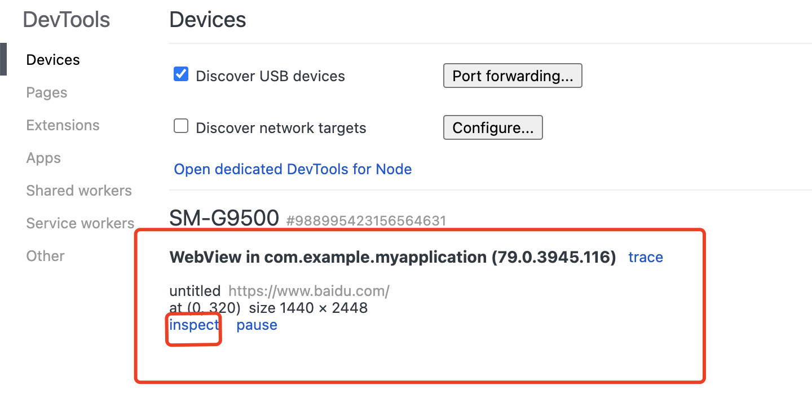
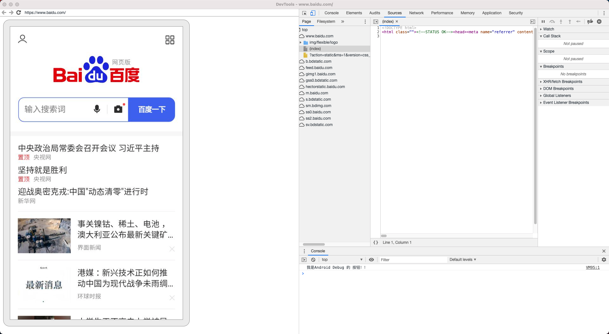
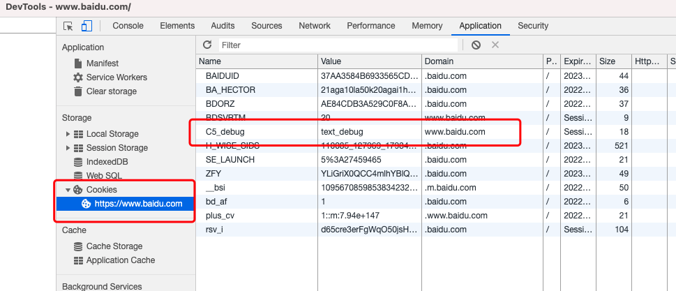
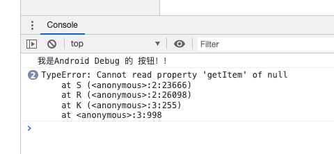
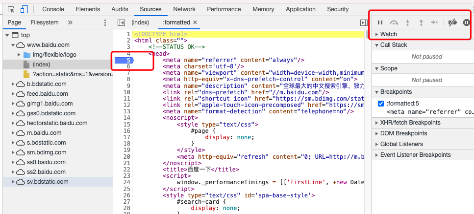
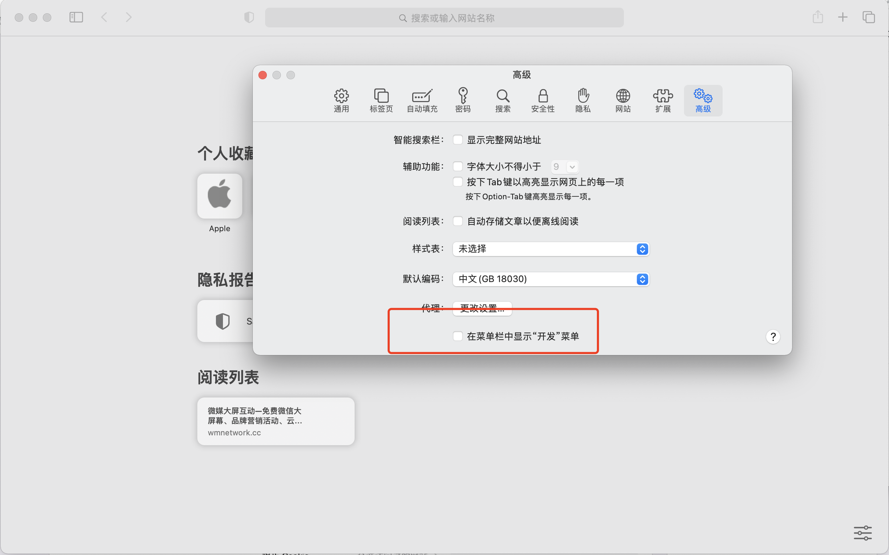
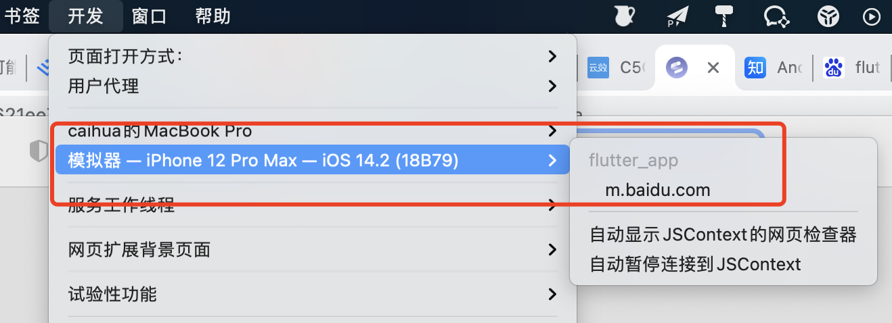
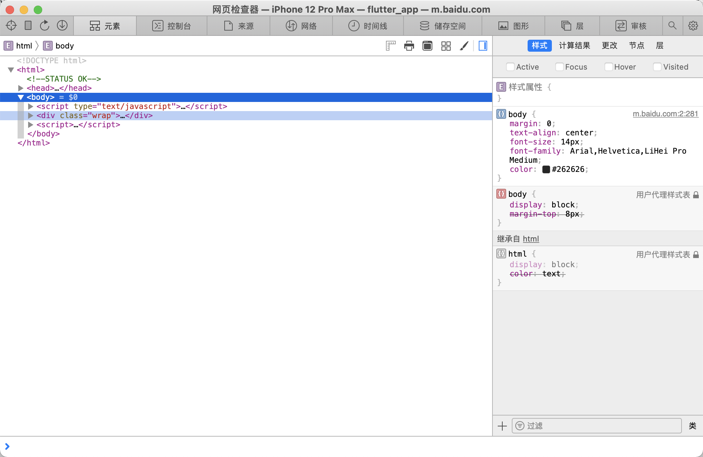
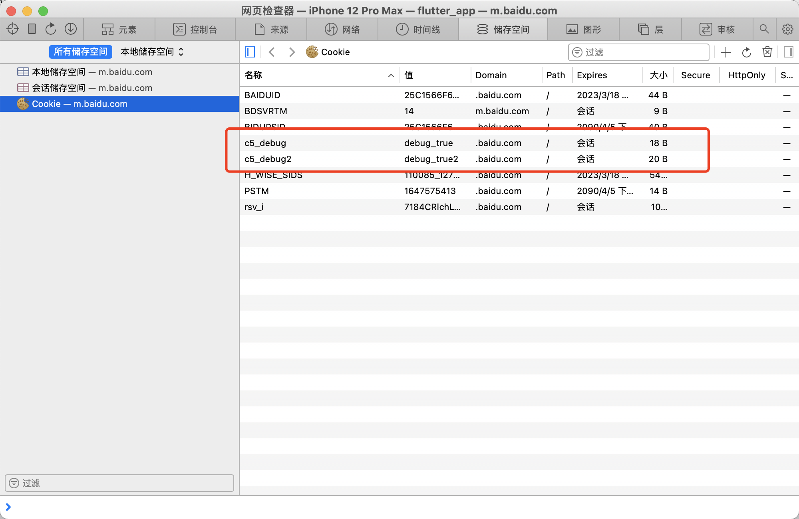

# Android和iOS WebView调试方法

## Android WebView

### 准备工具
1. 要启用 WebView 调试，请在 WebView 类上调用静态方法 setWebContentsDebuggingEnabled。
   
   ```bash
   WebView.setWebContentsDebuggingEnabled(true)
   ```

2. VPN代理
3. Chrome浏览器打开 chrome://inspect/#devices
4. 开启手机开发者模式，允许USB调试（wifi 调试还没试过，但原理应该是一致的，大概率也是可行的

### 准备工具

1. 准备就绪后，打开Android的 WebView后，会在chrome://inspect/#devices看到如下界面
    

2. 可能有多个webview的使用，点击对应inspect后，打开正式的调试界面
    
3. 最常用的debug场景可能就是查看注入的cookie
    
4. 还有查看console log  
    
5. 还可以断点调试
    

**花里胡哨 gogogo！**

***

## iOS WebView
### 准备工具

1. 开启Safari浏览器开发菜单 - 在Mac的Safari偏好设置中，开启开发菜单。具体步骤为：Safari -> 偏好设置… -> 高级 -> 勾选在菜单栏显示“开发”菜单。
   
2. iPhone开启网页检查器 - 设置 -> Safari -> 高级 -> 网页检查器。
    

### 使用
1. 运行app，打开WebView页面，可在safaris 的开发中看到对应的H5页面标签
    
2. 点击打开后可看到调试界面
    
3. 查看注入的cookie
    
4. 断点调试等
    